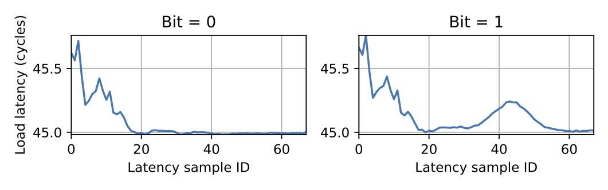
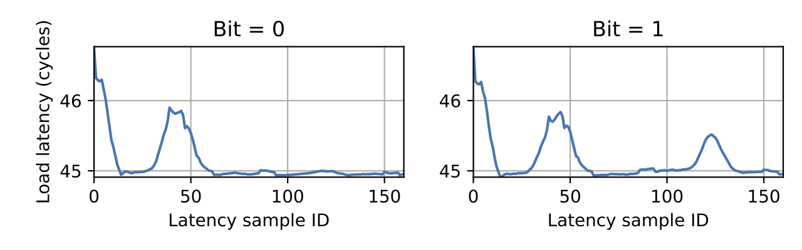

# Side-Channel Attack on Cryptographic Libraries

This folder contains code that implements a side-channel attack using the mesh interconnect.
The `attacker` collects latency samples while the `victim` runs a vulnerable cryptographic function.
The latency traces can be used to infer key bits.

## Prerequisites

**Expected Runtime: 2 min**

- Build the attacker with `make`.
- From the `victim` directory, clone, patch and build the RSA victim as follows:
```sh
# Clone official libgcrypt
git clone --depth 1 --branch libgcrypt-1.5.2 https://github.com/gpg/libgcrypt.git libgcrypt-1.5.2

# Apply our patch (use --dry-run to check before doing this)
cd libgcrypt-1.5.2
patch -p1 < ../libgcrypt-1.5.2.patch

# Compile the victim
# You may have to apt install dependencies (e.g., libpgp-error-dev, fig2dev, texinfo)
automake --add-missing		# To fix a bug with libgcrypt 1.5.2
./autogen.sh && ./configure --enable-maintainer-mode && make -j`nproc`
```
- From the `victim` directory, clone, patch and build the ECDSA victim as follows:
```sh
# Clone official libgcrypt
git clone --depth 1 --branch libgcrypt-1.6.3 https://github.com/gpg/libgcrypt.git libgcrypt-1.6.3

# Apply our patch (use --dry-run to check before doing this)
cd libgcrypt-1.6.3
patch -p1 < ../libgcrypt-1.6.3.patch

# Compile the victim
# You may have to apt install dependencies (e.g., libpgp-error-dev, fig2dev, texinfo)
./autogen.sh && ./configure --enable-maintainer-mode && make -j`nproc`
```
- Ensure that the Python virtual environment is set up in the parent directory.

## Single-Bit Classification Accuracy

**Expected Runtime: 30 min (15 min each for ECDSA and RSA)**

Make sure that your system is idle and minimize the number of background processes that are running and may add noise to the experiment.
Then, to reproduce the results of the paper, follow the steps below.
Note that you will use a script called `orchestrator.py` that is responsible for orchestrating the victim and the attacker/monitor processes and carrying out the attack.

Before running, double check the following:

- Both victims and monitor are compiled (see Prerequisites above)
- Your system is idle and there are a minimum number of background processes running.
- You are in the `03-side-channel` directory
- No other victim is running (if you ran the attack before, see step 5 below).

To run the attack:

1. Set up the environment: `./setup.sh`
2. Start **one** victim in the background
    - RSA: `sudo ./victim/libgcrypt-1.5.2/tests/mesh-victim &`
    - ECDSA: `sudo ./victim/libgcrypt-1.6.3/tests/mesh-victim &`
3. Run the orchestrator: `sudo ../venv/bin/python orchestrator.py --collect 5000 --train`
    - You can change the `--collect` value to adjust the number of repetitions
4. Stop the background victim process: `sudo pkill -f mesh-victim`
5. Clean up the environment: `./cleanup.sh`

### Output

The orchestrator should report the single-bit classification accuracy achieved.
On average, these accuracies should be at or above the stated accuracy in the paper.

The plots can also be seen in the `plots` directory.
If frequency pinning is disabled in `util/setup-prefetch-on.sh`, the plot filtering thresholds (`low_thres` and `high_thres`, labeled with `FIXME`) need to be lowered.
40 and 85 worked well for the low and high thresholds respectively.

Note that some variance (both in the plots and in the classifier accuracy) is expected due to noise in the collected data and/or differences in the hardware/software.
For the plots, the presence of the second spike for a 1 bit (as described in the paper) is more important than the exact shape of the curve.

Some example plots are shown below.


*RSA trace*


*ECDSA trace*

## Full-Key Recovery

**Expected Runtime: 30 hours (15 hours each for ECDSA and RSA)**

Due to the long runtime, it is recommended that you run this inside a `tmux` window.

1. Open a new `tmux` window
2. Navigate to `dont-mesh-around/side-channel` 
3. Run `sudo ./setup.sh`
4. Start the victim
    - RSA: `sudo ./victim/libgcrypt-1.5.2/tests/mesh-victim &`
    - ECDSA: `sudo ./victim/libgcrypt-1.6.3/tests/mesh-victim &`
5. Run the orchestrator
    - RSA (use 200 training keys): `sudo ../venv/bin/python orchestrator.py --fullkeyrecoverycollect 200 200 --fullkeyrecoverytrain --fullkeyrecoverytest`
    - ECDSA (use 800 training keys): `sudo ../venv/bin/python orchestrator.py --fullkeyrecoverycollect 800 200 --fullkeyrecoverytrain --fullkeyrecoverytest`
6. Stop the background victim process: `sudo pkill -f mesh-victim`
7. Clean up the environment: `./cleanup.sh`

### Output

The output of the full-key recovery is printed out to the terminal.
It shows the percentage of the key recovered with an increasing number of traces used in the majority-voting algorithm.

## Troubleshooting

Some variance (both in the plots and in the classifier accuracy) is expected due to noise in the collected data and/or differences in the hardware/software.
To try to reduce this variance, we recommend the following steps.

First, double-check that your system is idle and that you minimized the number of background processes.
Second, make sure that you only have one `mesh-victim` and no `mesh-monitor` processes running before you start the orchestrator.
Also, note that it may take a couple of runs for the results to stabilize.

## Note

This proof of concept implementation uses root privileges to get the physical address in the slice mapping function.
However, as discussed in the paper, the slice mapping of an address can be computed with unprivileged access too (by using timing information).
That is, root access is not a requirement of the attack and is used in our implementation only for convenience.
