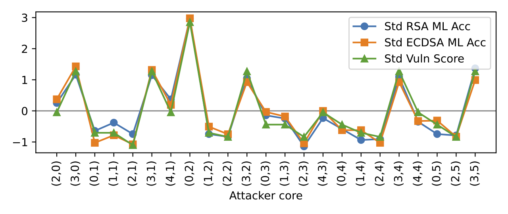

# Analytical Model

This directory contains the analytical model used to create the software-based mitigations and analyze the vulnerability of various cores.

## Prerequisites

- Make sure `config.py` contains the correct die layout information for your processor.
- Make sure you have built the binaries in `side-channel` with `make`.

## Analytical Model Usage

**Expected Runtime: 1 min**

The core of the analytical model is provided by the `get_config_contention` function inside `predict_contention.py`.
This function returns the relative contention level observable by an attacker for a particular configuration of victim and attacker.
An example of how to use this function can be found in `make-heatmap.py` which generates the data used to make the heatmap in Figure 12.
This can be run with `../venv/bin/python make-heatmap.py`.

## Model Verification

Model verification requires two steps: data collection and plotting.
We use the single-bit classification accuracy from the `side-channel` directory to validate our model.
The output from the side channel runs is piped into the `analytical-model` directory where the `model-validation.py` script will produce the correlation plot shown in Figure 13.

### Data Collection

**Expected Runtime: 14 hours (approx 7 hours each for ECDSA and RSA)**

To run the model verification, you will need to switch into the `side-channel` directory and use the orchestrator script.
Run the commands below starting from the current directory (`analytical-model`).
Because this is a long-running job, it is recommended to run it inside a `tmux` session.

```bash
# Make a data directory in the analytical model directory to hold the output
mkdir data

# Enter the side-channel directory
cd ../03-side-channel

# Run the setup script
./setup.sh

# --------------------------------------------
# Collect ECDSA first
# Start the victim
sudo ./victim/libgcrypt-1.6.3/tests/mesh-victim &

# Run the orchestrator (this step will take about 7 hours)
sudo ../venv/bin/python orchestrator.py --analyticalmodelverify | sudo tee ../04-analytical-model/data/model-verification-ecdsa.out

# Stop the background victim process
sudo pkill -f mesh-victim

# --------------------------------------------

# Collect RSA next
# Start the victim
sudo ./victim/libgcrypt-1.5.2/tests/mesh-victim &

# Run the orchestrator (this step will take about 7 hours)
sudo ../venv/bin/python orchestrator.py --analyticalmodelverify | sudo tee ../04-analytical-model/data/model-verification-rsa.out

# Stop the background victim process
sudo pkill -f mesh-victim

# --------------------------------------------
# Data collection is complete
# Cleanup the environment
./cleanup.sh
```

### Plotting

**Expected Runtime: 1 min**

The output from the orchestrator is piped into `analytical-model/data`.
This output is parsed by the `model-verification.py` script which can be run with `../venv/bin/python model-verification.py`.

An example verification plot is shown below.



## Mitigation Effectiveness

**Expected Runtime: 5 min**

We use the analytical model to evaluate the effectiveness of our mitigation.
Run `../venv/bin/python plot-mitigation-effectiveness.py` to reproduce Figure 14.
The plot can be found in `plot/mitigation-effect.pdf`
The script will also print out the raw data in Table 3.
